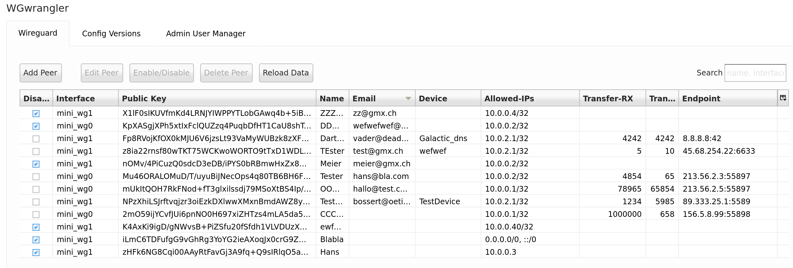
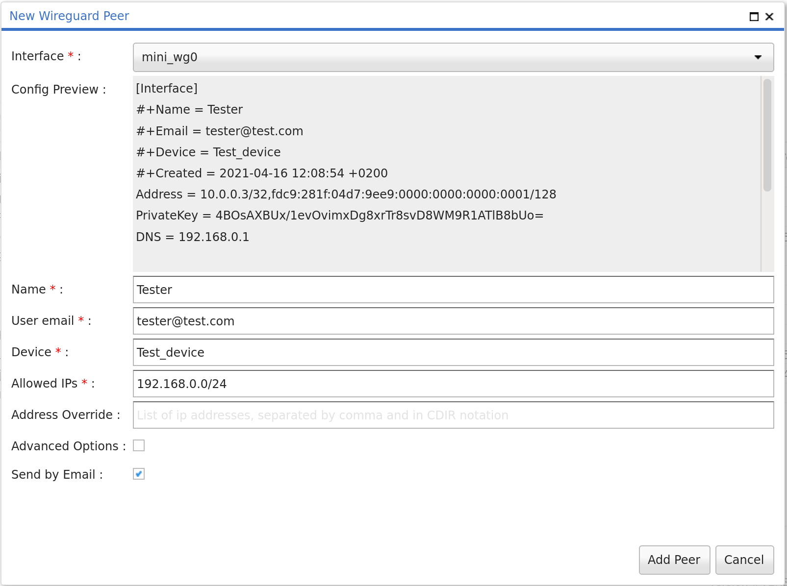
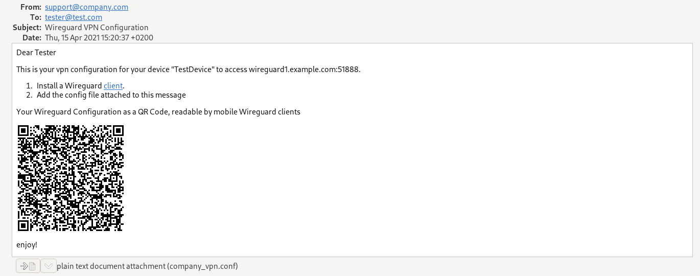

WGwrangler
===========
Version: 0.2.2
Date: 2022-12-20

WGwrangler is a web application to manage local Wireguard Configuration using 
[wg-meta](https://metacpan.org/release/Wireguard-WGmeta) in its backend. 

It comes complete with a classic "configure - make - install" setup.

Installation
------------

Download the current release distribution

```console
# Install os dependencies
sudo apt install libqrencode-dev

./configure --prefix=$HOME/opt/wgwrangler
make
```

**Minimum Node.js: `v14` -> If no compatible node version is found, the frontend is not built!**

Configure will check if all requirements are met and give
hints on how to fix the situation if something is missing.

Any missing perl modules will be downloaded and built.

To install the application, just run

```console
make install
```

You can now run wgwrangler in reverse proxy mode.

```console
cd $HOME/opt/wgwrangler/bin
./wgwrangler prefork
```

OS Preparation (after manual installation)
-------------

Since managing wireguard using its associated `wg*` commands requires root privileges we suggest the following
setup:

- Create a separate user/group e.g `wireguard_manager`
- Whitelist the `wg` commands for this group in the `/etc/sudoers` file:
  ```text
  %wireguard_manager ALL=NOPASSWD: /usr/bin/wg*
  ```
- Set `wireguard_manger` as group on `/etc/wireguard` and adjust permissions to `g+rwx`
- Additionally, creating a `wg-wrangler.service` file may improve usability quite a bit:
  ```text
  # This is to be considered as a (very) simple example of such a .service file
  [Unit]
  Description=wg-wranger wireguard manager
  
  [Service]
  Type=simple
  User=wireguard_manager
  Group=wireguard_manager
  ExecStart=/usr/bin/perl /home/wireguard_manager/opt/wgwrangler/bin/wgwrangler prefork --listen 'http://0.2.2.1:7171'
  
  [Install]
  WantedBy=multi-user.target
   ```

Installation (deb Package)
---------

The steps described in the manual installation section are done automatically when you install one of the provided `.deb` packages.
Configuration resides in `/etc/opt/wg-wrangler`.

Currently supported ubuntu versions:

- 18.04 LTS
- 20.04 LTS
- 22.04 LTS

Configuration
-------------

Do get started, rename `/etc/opt/wg-wrangler/wgwrangler.dist.yaml` to `/etc/opt/wg-wrangler/wgwrangler.yaml` and adjust
according your needs. 

Development
-----------

While developing the application it is convenient to NOT have to install it
before runnning. You can actually serve the Qooxdoo source directly
using the built-in Mojo webserver.

```console
./bin/wgwrangler-source-mode.sh
```

You can now connect to the CallBackery app with your web browser.

If you need any additional perl modules, write their names into the PERL_MODULES
file and run ./bootstrap.

**Honored Environment Variables**

- `WGwrangler_NO_WG` If defined, we do not call any wg* command from code (e.g. to generate pub/private-keys)
- `WGwrangler_CONFIG_HOME` Use this variable to set the path to the main configuration files (email template + main config)

Packaging
---------

Before releasing, make sure to update `CHANGES`, `VERSION` and run
`./bootstrap`.

You can also package the application as a nice tar.gz file, it uses carton to
install dependent module. If you want to make sure that your project builds with perl
5.22, make sure to set the `PERL` environment variable to a perl 5.22
interpreter, make sure to delete any `PERL5LIB` environment variable, and run
`make clean && make`. This will cause a `cpanfile-0.2.2.snapshot` file to be included
with your tar ball, when building the app this snapshot will be used to make sure
all the right versions of the dependent modules get installed.

```shell
make dist
```

Build deb package locally
-------------------------

```shell

# To build ubuntu 22 package
cd wg-wrangler
docker run --rm -v $(pwd):/mnt -it ubuntu:22.04 /bin/bash

# inside the docker container
./build_local.sh

# copy the package
cp /src/wg-wrangler_*_amd64_*.deb /mnt

```

Screenshots
-----------








Enjoy!

Tobias Bossert <bossert _at_ oetiker _this_is_a_dot_ ch>
